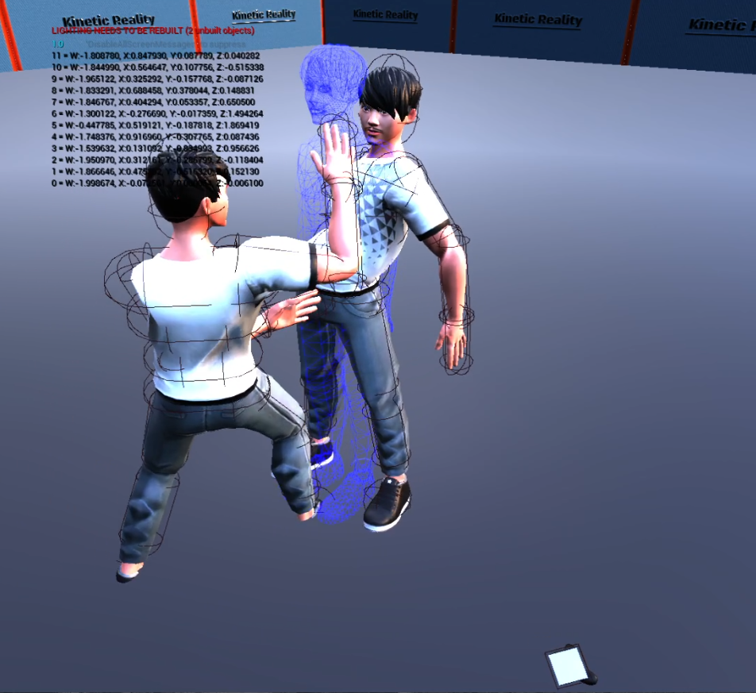
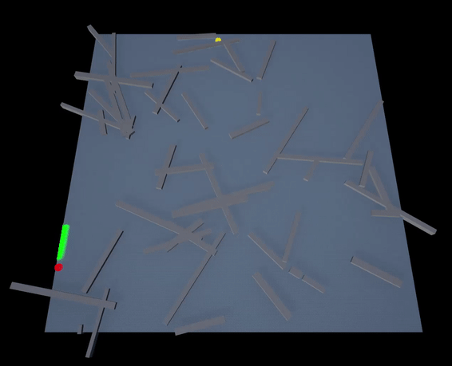
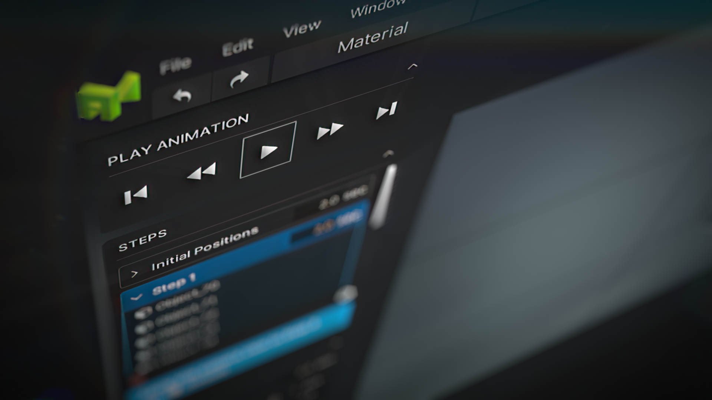
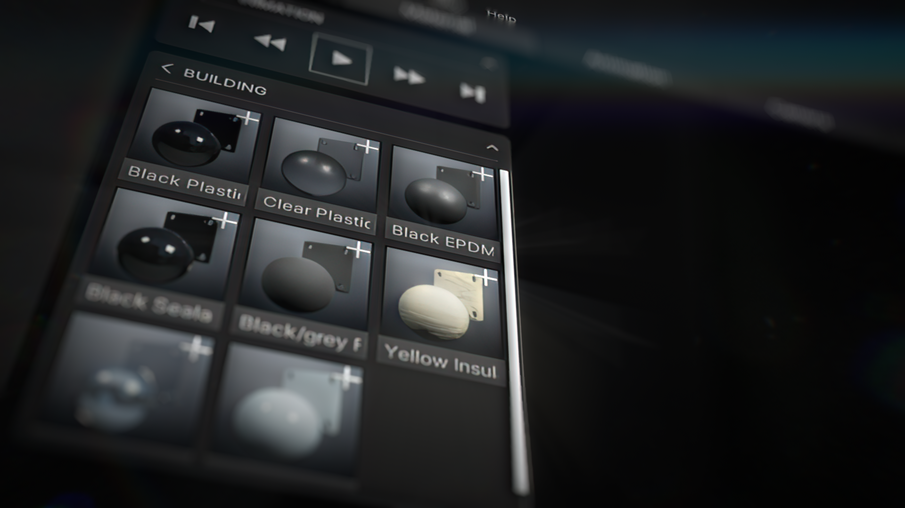
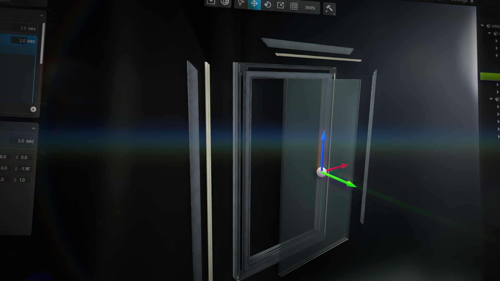

# Sergei Litovchenko

serglit10229@gmail.com  
(650) 471-4836  
San Jose, CA 95116  
[linkedin.com/in/SergeiL](https://linkedin.com/in/SergeiL)

### Summary:
Results-driven software developer with a strong background in game development using Unreal Engine 4/5, Unity, and custom OpenGL game engines. Proven experience in creating VR, mobile, and desktop games with intricate mechanics and optimized performance. Skilled in delivering high-quality, efficient, and reliable code. Committed to staying current with industry trends and advancements in technology.

### Skills:
Programming Languages: C++ (4 years), C# (4 years), C (2 years), Java (2 years), MATLAB
API and Libraries: Unreal Engine 4/5, Unity 2021.2, Oculus (OpenXR), SteamVR, GLFW 3.3, OpenGL 4.6, Direct3D 11/12, Win32 API

## Full-body Tracking UE4 SDK + Demo Games
  
Tasked to create a communication protocol between Unreal Engine 4 game/application and Kinetic Reality Proprietary full-body motion tracking hardware on local WIFI network. 
* Developed a UDP packet reading/writing SDK in native C++ for low-latency communication with KR sensors on LAN
* Assisted in hardware-side UDP communication code development and debugging
* Created a custom sockets plugin using UE4 FSocket API with cross-platform capabilities
* Optimized and maintained the plugin for use in Android-based builds for Meta Quest 1/2 wireless VR headsets
* Implemented Blueprint and C++ components for quick and scalable development of games/apps utilizing full-body tracking on Skeletal Mesh and Static Mesh systems
* Included physics adjustment to simulate a character standing on their feet and used inverse-kinematics calculation methods.

Developed two standalone VR games using UE4 and the KR SDK for internal testing and tech demonstrations
* KR Tennis features realistic tennis ball and racquet physics, demonstrating the KR hardware's low-latency support and tolerance for fast-accelerating movements. Allows biomechanics analysis to be performed on recorded or real-time player movements, and supports multiplayer matches
* KR Combat is an arcade martial arts fighting simulator for PvE and PvP, designed for shows and conferences like GDC 2023. Designed and implemented a simple VFX feedback emulation to simulate force feedback and visualization of damage in the virtual environment, as players do not physically hit each other.

  

## Simple A* Pathfinding implementation
As a part of KR Combat demo, I was tasked to create a PvE game mode with a simple AI that would run around the level and/or chase the player and apply damage via pre-determined animated moves. I experimented with a lighter(for Quests) navigation system than what UE4/5's built in AI system. 

* Created a native implementation of the A* grid-based pathfinding algorithm
* Demonstrates dynamically generated obstacles that can be created in the editor or at runtime
* Navigation manager finds the best path from point A to point B and outputs the path with grid square locations. Then, retraces the path for visualization
* Successfully implemented the algorithm for AI navigation in KR Combat game and ran on Quest 2 for a fun VR demo.

## Custom Voxel Destruction System Experiment
Created a voxel-based destruction system designed for 60fps games, that can be changed or created at runtime, and is scalable. The system is designed to run faster than UE4/5's built-in Chaos destruction.

.gif)

* Demonstrates a multi-story building made out of instanced triangular chunks, with over 33,000 chunks
* When the building receives damage above a certain threshold, all chunks within a specified radius from the impact location are destroyed, creating a hole
* The system is scalable, supporting multiple buildings on the same level with up to 2 million chunks each
* The system can be used for irregular chunks like glass, with different materials and abstract shapes
* In 90% of cases, the entire algorithm runs asynchronously in under 5ms, even with 30 million chunks in the level.

.gif)

* Implemented an island-searching algorithm to determine if any part of a building is no longer connected to the neighbor components and needs to be destroyed
* Helps prevent large parts of a building from hovering in the air
* Updated with cool VFX and is being used in another personal project on movable vehicles.

## Schuco Animation Kit
Tasked to initialize, develop, and deliver a complete software package for 3D model animation and for visualization and presentation. Allows people without prior experience in animation to create simple assembly/disassembly animated videos of their 3D models.

      
* Intended for use by people without prior experience in animation
* Designed for engineers and managers to visualize products and simplify manufacturing and training processes.

* Utilized Unreal Engine’s real-time rendering backend and proprietary engineering solutions to create real-time animation rendering
* Led the development of UI/UX, frontend, and backend systems for the software package
* Shipped a complete desktop tool that can be used both within and outside of Schuco International Engineering departments

